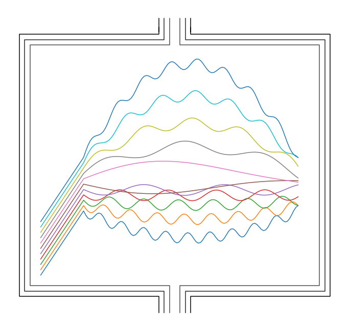
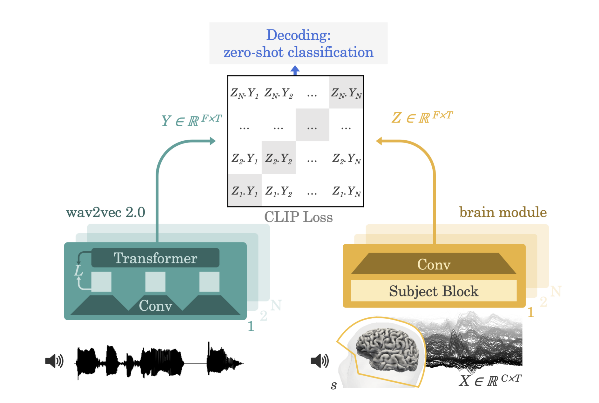

[](https://dl.circleci.com/status-badge/redirect/gh/facebookresearch/brainmagick/tree/main)

# Decoding speech from non-invasive recordings of brain activity


<p align="center">
</p>


This is the code for the [Decoding speech from non-invasive brain recordings][paper].
paper, published in Nature Machine Intelligence in 2023 (also available on [arxiv][paper_arxiv]). 
In this work, we present a novel method to perform high performance decoding
of perceived speech from non invasive recordings. Inspired by [CLIP][clip], we use
a contrastive loss between a learnt representation of the brain signals (EEG or MEG)
and a representation ([Wav2vec 2.0][wav2vec2]) of candidate audio segments.

We validate our approach on 4 datasets (2 with MEG, 2 with EEG), covering 175 volunteers
and more than 160 hours of brain recordings. On the Gwilliams dataset, we achieve more than 41% top-1
accuracy, meaning that we can identify exactly which sentence, and which word in that sentence,
a subject is currently listening to, among more than 1300 candidates that were not seen at train time.

<p align="center">
</p>


## What's new?

See [the changelog](./CHANGELOG.md) for details on releases.


## Requirements

You should have at least one NVIDIA GPU to perform training, with 16GB of memory.
You can reduce memory usage by lowering the batch size (although this can affect the
dynamic of the contrastive loss), see after.

You can create a new conda environment and install the required dependencies
```shell
conda create -n bm ipython python=3.8 -y
conda activate bm
conda install pytorch torchaudio cudatoolkit=11.3 -c pytorch -y
pip install -U -r requirements.txt
pip install -e .
# For the Broderick dataset, you will further need the following model.
python -m spacy download en_core_web_md
```
You can adapt the cudatoolkit version to fit your installation.

This code has only been tested on Ubuntu 20.04. Installation should take
up to 20 minutes with a good internet connection.


## Data & Studies

In the context of this project, we call a *study* a single source of brain
recordings along with their metadata and annotations.
We support four studies, as presented in Table 1 of [our paper][paper].
As a first step, please update the following file which contains the
paths to each study.
```
bm/conf/study_path/study_paths.yaml
```

Studies are automatically downloaded the first time an experiment uses them.
**Do not launch more than one job on a study the first time** you use it,
to limit the chances of corruption. Do not launch a distributed job either
(e.g. use `dora run`, not `dora run -d`).

Each study is composed of *recordings*, with one recording
being a continuous recording of brain activity. Each recording also contains sparse annotations such as "At 31.6 seconds, the audio file sentence45.wav was played".

*Selections* are named selections of recordings inside one dataset. For instance
`visual_mous` contains only recordings from subjects performing a visual task in the `schoffelen2019` study. `audio_mous` similarly restrict to the audio task.

As of now, we support 4 studies (refer to [Table 1 in our paper][paper] for more info):
- `broderick2019`: EEG, 128 sensors, 19 subjects, 19.2 hours, [reference](https://pubmed.ncbi.nlm.nih.gov/29478856/).
- `brennan2019`: EEG, 60 sensors, 33 subjects, 6.7 hours, [reference](https://journals.plos.org/plosone/article?id=10.1371/journal.pone.0207741).
- `audio_mous` (Scheffelen2019 in the paper): MEG, 273 sensors, 96 subjects, 80.9 hours, [reference](https://www.nature.com/articles/s41597-019-0020-y). **Important:** this study requires registration
before being able to download. Please see the original publication for details.
- `gwilliams2022` : MEG, 208 sensors, 27 subjects, 56.2 hours, [reference](https://www.nature.com/articles/s41467-022-34326-1).

We recommend starting with the `gwilliams2022` study, as it is the easiest to access, and the one
for which our method achieves the highest accuracy.

### Preprocessing and cache

The brain data (e.g. MEG) is processed with potential downsampling and low/high pass filtering.
The sparse annotations are processed to obtain dense embeddings, called **features** in this codebase, e.g. a word embedding, mel-spectrogram, etc.

The most expensive computations are cached (high pass filtering, subsampling of the MEG, Wav2Vec 2.0 embeddings). The cache path should be set in `conf/config.yaml`, look for the `cache: ...` line. Pre-trained models will be stored under
the `features_models: ...` path defined in the same file. If you change anything
of importance in the code of the features or data processing, remember you might need to delete the cache.

The first run with a given dataset will thus be extremely slow and we advise against starting more than one job on a dataset the very first time. In order to run just the download and preprocessing
for a given dataset, use the following command:

```bash
dora run download_only=true 'dset.selections=[gwilliams2022]'
```
replacing `gwilliams2022` based on the desired study.

## Training

We use [Hydra][hydra] for managing our configuration and [Dora][dora]
for launching and managing experiments. You might want to quickly go over
the README of Dora before trying to train a model.


### Local training

To start training, from the root of the repository, run
```bash
dora run [-f SIG] [-d] [--clear] [ARGS]
```

The `-d` flag will activate distributed training on all available GPUs.

The `-f SIG` flag will inject all the args from the XP with the given signature first, and then
complete with the one given on the command line.

`--clear` will remove any existing XP folder, checkpoints etc.

`[ARGS]` is a list of overrides for the Hydra config. See [conf/config.yaml](conf/config.yaml) for a list of all parameters.
For instance, to load fewer recordings (on the default `gwilliams` study), you can do:
```
dora run dset.n_recordings=4
```

For training on a different study, like `audio_mous` (e.g. `Schoffelen2019` restricted to audio tasks), you can run
```
dora run 'dset.selections=[audio_mous]'
```

**Important:** we trained on 2 GPUs. The number of GPUs matter a lot for contrastive
losses because the negatives are taken only within the same GPU! The overall batch size
is divided by the number of gpus, e.g. 256 means 128 on each GPU. For this reason
we do not recommend training on too many GPUs (e.g. 8). You can restrict
the GPUs used by `dora` by exporting `CUDA_VISIBLE_DEVICES=...`.

### XP signature and backward compatibility of config

Dora assigns to each experiment (XP) a signature that depends on its hyper params. When running
twice the same XP with the same hyper-params, Dora will find back the previous XP folder and
reuse any checkpoints etc.
In fact, the signature is defined from the delta between the base config and the actual XP config.
This is so that when adding a new param in the config, the XP signature doesn't change
for all existing XPs. This means changes to the config files should always be backward compatible,
except at some major updates. It is possible to create files like the ones in `conf/model/`
to store useful templates of config.

### Grid files

Larger scale experiments should be conducted within grid files. Grid files are defined in `bm/grids/` as normal python files. Define all the XP you want:

```python
from ._explorers import ClipExplorer


# Decorator class defines what metrics to track and other metadata.
@ClipExplorer
def explorer(launcher):
	# Methods `slurm_` and `bind_` are in-place.
    launcher.slurm_(gpus=4)  # All XPs scheduled with `launcher` will use 4 gpus.
    launcher.bind_({'norm.max_scale': 20, 'dset.n_recordings': 60})  # set common params.

    more_subjects = {'dset.n_recordings': 100}
    selections = ['visual_mous', 'gwilliams2022', 'fleur2020']

    for selection in selections:
        # The `bind()` method returns a sub-launcher with different params.
        # This won't affect the original launcher.
        sub = launcher.bind({'dset.selections': [selection]})
        # You schedule experiments by calling the (sub)-launcher.
        sub()
        sub({'optim.batch_size': 128})  # does batch size influence CLIP ?
        sub(more_subjects)
```

If the file is called `bm/grids/mygrid.py`, run
```bash
dora grid mygrid
```
This will schedule all required XPs. If you change the experiments defined in the
file, it will cancel any job that is no longer required, and schedule any new
job required (e.g., you can cancel a job by commenting the corresponding line).

Some useful flags:
- `-r`: retry all failed or cancelled XPs.
- `-C`: cancel all jobs.
- `-T{IDX}`: trim all metrics to match the number of epochs of the XP
	with the given index in the grid.
- `-t{IDX}`: show the log from the XP with the given index in the grid.

If you want to restart from scratch (you changed some important code), then either
use the `dummy` parameter in the config in the top level `bind_()`, or use the `--clear` flag:
```
dora grid mygrad --clear
```
This will ask confirmation first, because this is quite a dangerous command!!

**Git repository must be clean** when launching a grid. This is because Dora will
store a clone of the repo at the current commit in order to isolate the XP from
any future changes.

### Grids for reproducing our paper

The main results can be reproduced with `dora grid nmi.main_table`.
Checkout the [grids folder](./bm/grids/) for the available grids,
in particular the `nmi` subfolder. Running a grid requires a SLURM cluster.

**Important trick:** Even if you do not have access to a SLURM cluster, you can run `dora grid nmi.main_table --dry_run --init`. This will initialize the database of experiments
with the hyperparameters. Then you can easily run an experiment, e.g. for
running the experiment on the Broderick dataset:

```
dora run -f 557f5f8a -d
```

The following command will prove useful for getting the signature for all 4 datasets:
```
dora grid nmi.main_table '!seed' '!features' '!wer_random` --dry_run --init
```

## Evaluations

The evaluation requires running a separate script. Once a grid is fully trained,
you can run the evaluation on it with

```bash
python -m scripts.run_eval_probs grid_name="main_table"
```

If you are on a SLURM cluster, you can add `distributed="true"` to run the evals for
each XP in a different job. The eval can take up to 30 min per XP.

Finally, checkout the [notebook_templates](./notebook_templates) folder for reference
on how to load the evaluations and reproduce the tables in our paper.

## Tests

Tests are configured to run upon pushing changes (configured with CircleCI).
To run tests manually (all tests at bm/test_*py):

```bash
pytest bm
```

To run the linter, type checker and tests you can also just run
```shell
make
```

**Important:** All tests and linters must pass before we consider a PR.

## Hiplot

After training, you can use hiplot to plot metrics. First start the hiplot server with:
```bash
python -m hiplot dora.hiplot.load --port=XXXX
```

Then enter any number of grid names or XP sigs separated by ' '. Also specify the
HiPlot Dora Explorer with `explorer=MainHP`, checkout `bm/grids/_hiplot.py` for more information.


## License

The present code is provided under the CC-NC-BY 4.0 license,
as provided in the [LICENSE](./LICENSE) file.

## Citation

If you use this code or results in your paper, please cite our work as:

```
@article{defossez2023decoding,
  title={Decoding speech perception from non-invasive brain recordings},
  author={D{\'e}fossez, Alexandre and Caucheteux, Charlotte and Rapin, J{\'e}r{\'e}my and Kabeli, Ori and King, Jean-R{\'e}mi},
  journal={Nature Machine Intelligence},
  year={2023}
}
```

[paper]: https://www.nature.com/articles/s42256-023-00714-5
[paper_arxiv]: https://arxiv.org/abs/2208.12266
[wav2vec2]: https://arxiv.org/abs/2006.11477
[clip]: https://arxiv.org/abs/2103.00020
[gwilliams]: https://www.nature.com/articles/s41467-022-34326-1
[hydra]: https://hydra.cc/docs/intro/
[dora]: https://github.com/facebookresearch/dora
